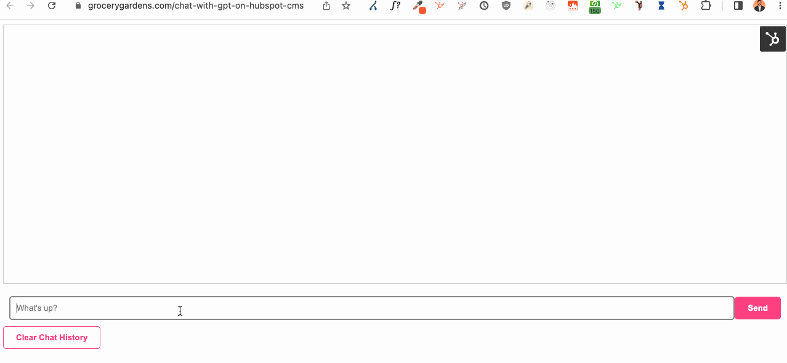

# GPT on HubSpot CMS

## This is a simple demo far from production ready

View the project live: https://www.grocerygardens.com/chat-with-gpt-on-hubspot-cms

This project uses a HubSpot serverless function and openAI's chat completions API from the JS library with gpt-3.5-turbo to create a basic chat UI on HubSpot's CMS
Ask questions, persist chat over refreshes using local storage, and clear your chat history.

To dos:
- Better care for token limits
- Add function calling (for fun)
- Segments chats by conversations
- Improve the UI

  

